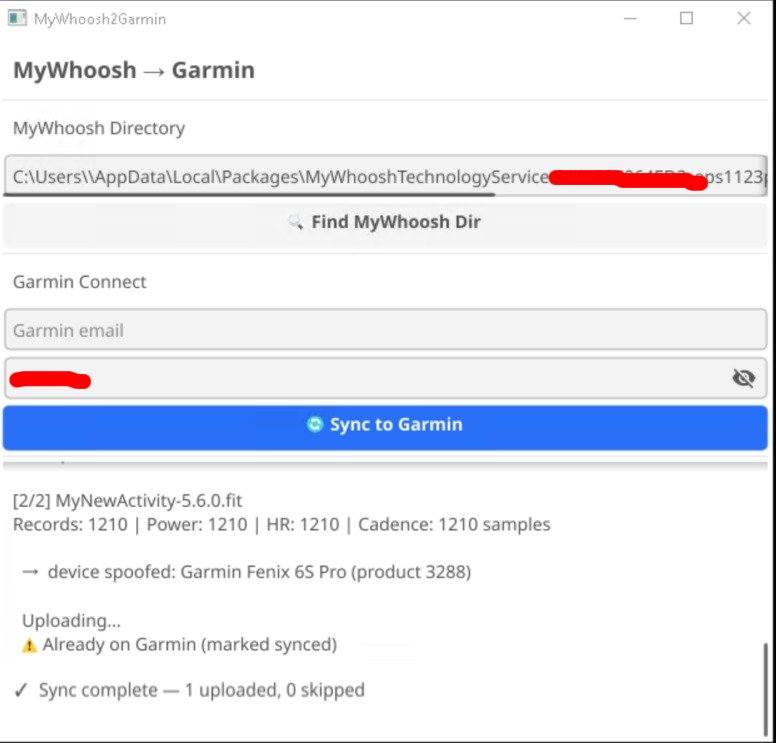

# MyWhoosh2Garmin

A single-executable GUI app that syncs your [MyWhoosh](https://www.mywhoosh.com/) indoor cycling activities to [Garmin Connect](https://connect.garmin.com/) — with full training effect, VO2max, and performance stats support.



## Why?

MyWhoosh exports FIT files, but they have issues that prevent Garmin from fully processing them:

- **Missing averages** — average power, heart rate, and cadence are not set in the session data
- **Bogus temperature** — every record contains a fake temperature reading
- **Unknown device** — Garmin ignores training effect and VO2max from unknown manufacturers

MyWhoosh2Garmin fixes all of this automatically:

| Problem | Fix |
|---|---|
| Missing avg power / HR / cadence | Calculated from ride records |
| Fake temperature data | Stripped from all records |
| MyWhoosh device identity | Spoofed to Garmin Fenix 6S Pro |

The result: your indoor rides show up on Garmin Connect just like a native Garmin recording, complete with **Training Effect**, **VO2max updates**, **Training Load**, and **Training Status**.

## Download

Grab the latest release for your platform from the [**Releases**](../../releases) page:

| Platform | File |
|---|---|
| Windows | `mywhoosh2garmin-windows-amd64.exe` |

No installation needed — just download and run.

## How to Use

### 1. Set the MyWhoosh directory

Click **🔍 Find MyWhoosh Dir** — the app will auto-detect the FIT file location:

- **Windows**: `%LOCALAPPDATA%\Packages\MyWhooshTechnologyService...\...\Content\Data`

If auto-detection doesn't work, a folder picker will open so you can select the directory manually.

### 2. Enter Garmin credentials

Enter your **Garmin Connect email** and **password**. These are only sent directly to Garmin's SSO servers — never stored or sent anywhere else.

After the first login, a session token is cached locally (`~/.mywhoosh2garmin/`) and reused for up to a year. You won't need to enter your password again unless the token expires.

### 3. Click Sync

Click **🔄 Sync to Garmin** and the app will:

1. Scan for FIT files modified in the last 30 days
2. Skip any that were already synced (`.synced` marker files)
3. Fix averages, strip temperature, spoof device identity
4. Upload each file to Garmin Connect
5. Mark successfully uploaded files so they won't be uploaded again

That's it. Your rides will appear on Garmin Connect within seconds.

## Building from Source

### Prerequisites

- Go 1.24+
- GCC (for Fyne/CGO)
- Windows cross-compile from Linux: `mingw-w64`, `libgl-dev`, `xorg-dev`, `libxxf86vm-dev`

### Build

```bash
# Linux
go build -o mywhoosh2garmin .

# Both platforms (requires mingw-w64)
./build.sh
# Output in dist/
```

### Run tests

```bash
go test ./...
```

## How It Works

```
MyWhoosh FIT file
       │
       ▼
  ┌─────────────────────┐
  │  Decode FIT (V2)    │
  │  Fix session avgs   │
  │  Strip temperature  │
  │  Spoof → Fenix 6S   │
  │  Encode FIT (V2)    │
  └─────────┬───────────┘
            │
            ▼
  ┌─────────────────────┐
  │  Garmin SSO Login   │
  │  OAuth1 → OAuth2    │
  │  Upload FIT file    │
  └─────────────────────┘
            │
            ▼
     Garmin Connect
  (Training Effect ✓)
  (VO2max ✓)
  (Training Load ✓)
```

## Credits

- [garth](https://github.com/matin/garth) by matin — Garmin SSO authentication reference
- [muktihari/fit](https://github.com/muktihari/fit) — FIT SDK for Go
- [Fyne](https://fyne.io/) — cross-platform GUI toolkit

## License

GPLv3 — see [LICENSE](LICENSE).
